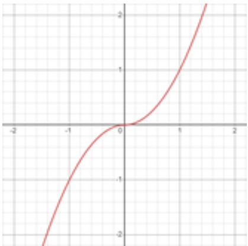
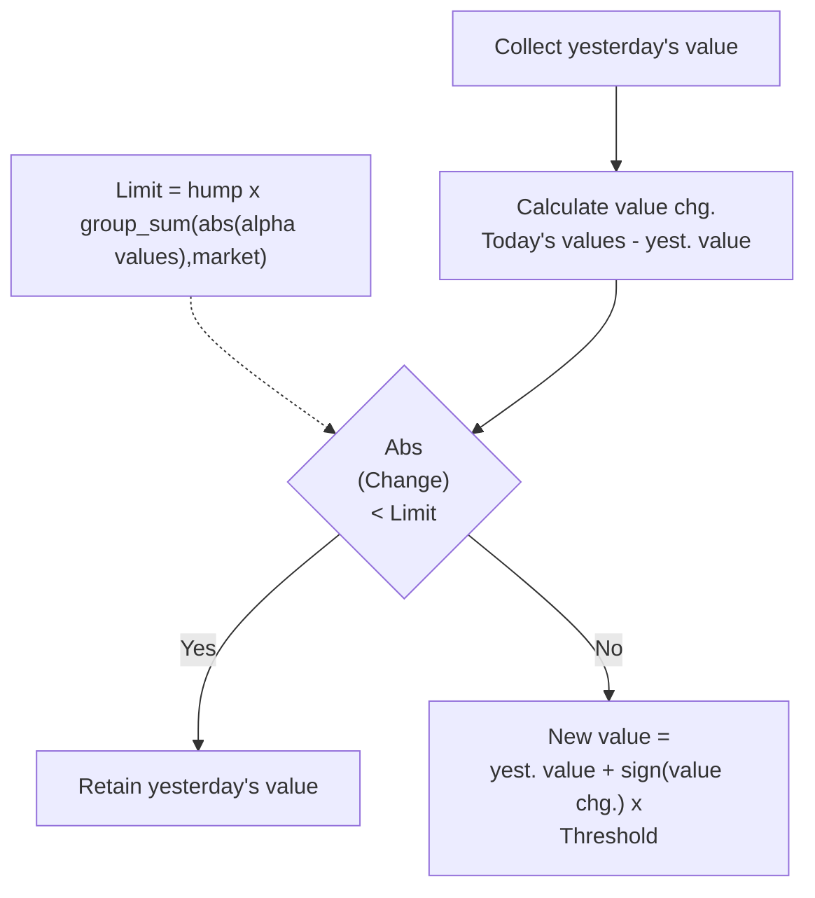

# Operators

## Arithmetic

### abs
**语法规则**: `abs(x)`
**功能简述**: Returns the absolute value of a number, removing any negative sign.

**详细说明**:
The absolute value is often used to ensure that only the size of a value is considered, not its direction.

**Examples:**
```python
abs(close - open)
```
This expression will output the absolute difference of the daily price change

---
### add
**语法规则**: `add(x, y, filter = false), x + y`
**功能简述**: Adds two or more inputs element wise. Set filter=true to treat NaNs as 0 before summing.

**详细说明**:
The add operator performs element-wise addition on two or more inputs. If the optional filter parameter is set to true, any NaN values in the inputs are treated as zero before the addition.

**Example calculations**

Suppose you have two vectors:
* x = [1, NaN, 3]
* y = [4, 5, NaN]
* `add(x, y)` returns [1+4, NaN+5, 3+NaN] = [5, NaN, NaN]
* `add(x, y, filter=true)` returns [1+4, 0+5, 3+0] = [5, 5, 3]

**Tips**
Use filter=true to treat NaNs as zeros. This can improve coverage and performance without the need to backfill the data.

---
### densify
**语法规则**: `densify(x)`
**功能简述**: Converts a grouping field of many buckets into lesser number of only available buckets so as to make working with grouping fields computationally efficient

**详细说明**:
This operator converts a grouping field with many buckets into a lesser number of only the available buckets, making working with grouping fields computationally efficient. The example below will clarify the implementation.

**Example:**
Say a grouping field is provided as an integer (e.g., industry: tech -> 0, airspace -> 1, ...) and for a certain date, we have instruments with grouping field values among {0, 1, 2, 99}. Instead of creating 100 buckets and keeping 96 of them empty, it is better to just create 4 buckets with values {0, 1, 2, 3}. So, if the number of unique values in x is n, densify maps those values between 0 and (n-1). The order of magnitude need not be preserved.

---
### divide
**语法规则**: `divide(x, y), x / y`
**功能简述**: x / y

---
### inverse
**语法规则**: `inverse(x)`
**功能简述**: 1 / x

---
### log
**语法规则**: `log(x)`
**功能简述**: Calculates the natural logarithm of the input value. Commonly used to transform data that has positive values.

**详细说明**:
The log(x) operator computes the natural logarithm (base e) of the input x. This transformation is widely used in finance to normalize data, reduce skewness, or convert multiplicative relationships into additive ones. The input x should be positive, as the logarithm is undefined for zero or negative values.

* If x = 10, then log(10) ≈ 2.3026
* If x = 1, then log(1) = 0
* If x = 0.5, then log(0.5) ≈ -0.6931

---
### max
**语法规则**: `max(x, y, ..)`
**功能简述**: Maximum value of all inputs. At least 2 inputs are required

**详细说明**:
**Example:**
```python
max(close, vwap)
```

---
### min
**语法规则**: `min(x, y ..)`
**功能简述**: Minimum value of all inputs. At least 2 inputs are required

**详细说明**:
**Example:**
```python
min(close, vwap)
```

---
### multiply
**语法规则**: `multiply(x, y, ... , filter=false), x * y`
**功能简述**: Multiplies two or more inputs element wise. Set filter=true to treat NaNs as 0 before multiplication

**详细说明**:
Computes the product of all inputs. You can pass any number of scalars or series: multiply(a, b, c) = a × b × c. When filter=true, NaNs are replaced with 1 before the product; when false, any NaN propagates to the result.

Example calculations:

* multiply(2, 3) = 6
* multiply(2, 3, 4) = 24
* multiply(5, NaN, filter=false) = NaN

multiply(5, NaN, filter=true) = 5 × 1 = 5

**Alpha Examples:**
```python
multiply(rank(-returns), rank(volume/adv20), filter=true)
```

---
### power
**语法规则**: `power(x, y)`
**功能简述**: x ^ y

**详细说明**:
```python
power (returns, volume/adv20); power (returns, volume/adv20, precise=true)
```

power (x, y) operator can be used to implement popular mathematical functions. For example, sigmoid(close) can be implemented using power(x) as:

```python
1/(1+ power(2.7182, -close)
```

---

### reverse
**语法规则**: `reverse(x)`
**功能简述**: - x

---
### sign
**语法规则**: `sign(x)`
**功能简述**: Returns the sign of a number: +1 for positive, -1 for negative, and 0 for zero. If the input is NaN, returns NaN. Input: Value of 7 instruments at day t: (2, -3, 5, 6, 3, NaN, -10) Output: (1, -1, 1, 1, 1, NaN, -1)

**详细说明**:
The sign(x) operator determines whether a value is positive, negative, or zero. It is commonly used to quickly identify the direction of a value. If the input is not a number (NaN), the result will also be NaN.

**Example calculations**
* sign(5) returns 1
* sign(-3.2) returns -1
* sign(0) returns 0
* sign(NaN) returns NaN

**Examples**
```python
sign(close - open)
```
* This expression returns:
  * 1 if the closing price is higher than the opening price,
  * -1 if the closing price is lower,

0 if they are equal.

---
### signed_power
**语法规则**: `signed_power(x, y)`
**功能简述**: x raised to the power of y such that final result preserves sign of x

**详细说明**:
**sign(x) * (abs(x) ^ y)**

x raised to the power of y such that final result preserves sign of x. For power of 2, x ^ y will be a parabola but signed_power(x, y) will be odd and one-to-one function (unique value of x for certain value of signed_power(x, y)) unlike parabola.



**Example:**
If x = 3, y = 2 => abs(x) = 3 => abs(x) ^ y = 9 and sign(x) = +1 => sign(x) * (abs(x) ^ y) = signed_power(x, y) = 9
If x = -9, y = 0.5 => abs(x) = 9 => abs(x) ^ y = 3 and sign(x) = -1 => sign(x) * (abs(x) ^ y) = signed_power(x, y) = -3 *(注：这里原图似乎被截断了，根据推导我补全了结果为 -3，原图显示为 y) )*

---

### sqrt
**语法规则**: `sqrt(x)`
**功能简述**: Returns the non negative square root of x. Equivalent to power(x, 0.5); for signed roots use signed_power(x, 0.5).

**详细说明**:
sqrt(x) = power(x, 0.5) for x ≥ 0. It reduces skew and compresses large positive values while keeping order. It returns NaN for x < 0. If you need a root-like transform that keeps the sign for negative inputs, use signed_power(x, 0.5), which computes sign(x)*sqrt(abs(x)).

**Example calculations**
* sqrt(9) = 3
* sqrt(0.25) = 0.5
* sqrt(0) = 0

sqrt(-4) = NaN (use signed_power(-4, 0.5) = -2 for a sign-preserving root)

---
### subtract
**语法规则**: `subtract(x, y, filter=false), x - y`
**功能简述**: Subtracts inputs left to right: x - y - ... Supports two or more inputs. Set filter=true to treat NaNs as 0 before subtraction.

**详细说明**:
Performs element-wise subtraction on scalars or series. You can pass more than two inputs; evaluation is left-to-right: subtract(a, b, c) = ((a - b) - c). When filter=true, any NaN in the inputs is replaced with 0 before subtraction; when false, NaNs propagate.

**Example calculations for the calculation walkthrough**
* subtract(10, 3) = 7
* subtract(10, 3, 2) = 5 (left-to-right: (10–3)–2)
* subtract(NaN, 5, filter=true) = 0 − 5 = −5

subtract(NaN, 5, filter=false) = NaN

---

## Logical 

### and
**语法规则**: `and(input1, input2)`
**功能简述**: Returns 1 ('true') if both inputs are 1 ('true'). Otherwise, returns 0 ('false').

---
### if_else
**语法规则**: `if_else(input1, input2, input 3)`
**功能简述**: The if_else operator returns one of two values based on a condition. If the condition is true, it returns the first value; if false, it returns the second value.

**详细说明**:
**if_else(event_condition, Alpha_expression_1, Alpha_expression_2)**

The if_else operator lets you choose between two expressions depending on whether a condition is met. This is useful for creating Alphas that react to market events, data thresholds, or other logical rules.

**Examples**

Event = volume > adv20;

if_else(Event, 2 * ts_delta(close, 3), ts_delta(close, 3))

* When volume spikes above its 20-day average, your position change doubles; otherwise it stays normal.

**Alpha Example**
```python
Event = volume > adv20;
alpha_1 = 2 * (-ts_delta(close, 3));
alpha_2 = (-ts_delta(close, 3));
if_else(event, alpha_1, alpha_2)
```

---
### <
**语法规则**: `input1 < input2`
**功能简述**: Returns 1 ('true') if input1 is a smaller than input2. Otherwise, returns 0 ('false').

---
### <=
**语法规则**: `input1 <= input2`
**功能简述**: Returns 1 ('true') if input1 is a smaller or the same as input2. Otherwise, returns 0 ('false').

---
### ==
**语法规则**: `input1 == input2`
**功能简述**: Returns 1 ('true') if input1 and input2 are the same. Otherwise, returns 0 ('false').

---
### >
**语法规则**: `input1 > input2`
**功能简述**: Returns 1 ('true') if input1 is a larger than input2. Otherwise, returns 0 ('false').

---
### >=
**语法规则**: `input1 >= input2`
**功能简述**: Returns 1 ('true') if input1 is a larger or the same as input2. Otherwise, returns 0 ('false').

---
### !=
**语法规则**: `input1 != input2`
**功能简述**: Returns 1 ('true') if input1 and input2 are different numbers. Otherwise, returns 0 ('false').

---
### is_nan
**语法规则**: `is_nan(input)`
**功能简述**: If (input == NaN) return 1 else return 0

**详细说明**:
is_nan(x) operator can be used to identify NaN values and replace them to a default value using if_else statement. For example:

```python
if_else(is_nan(rank(sales)), 0.5, rank(sales))
```

In this example, in case sales value is NaN for any instrument, then the expression will replace it with the mean value of rank, that is 0.5.

---
### not
**语法规则**: `not(x)`
**功能简述**: Returns the logical negation of x. Returns 0 when x is 1 ('true') and 1 when x is 0 ('false').

---
### or
**语法规则**: `or(input1, input2)`
**功能简述**: Returns 1 if either input is true (either input1 or input2 has a value of 1), otherwise it returns 0.

---

### days_from_last_change
**语法规则**: `days_from_last_change(x)`
**功能简述**: Calculates the number of days since the last change in the value of a given variable.

**详细说明**:
The days_from_last_change(x) operator returns how many days have passed since the last time the value of x changed. This is useful for tracking the “age” of the current value. Can be used as a trade_when condition.

**Example calculations**

| Date | X |
| :--- | :--- |
| 2024-06-01 | 10 |
| 2024-06-02 | 10 |
| 2024-06-03 | 12 |
| 2024-06-04 | 12 |
| 2024-06-05 | 12 |
| 2024-06-06 | 15 |

* On 2024-06-05: days_from_last_change(x) = 2
* On 2024-06-06: days_from_last_change(x) = 0

**Examples**
```python
Last_earnings_date = days_from_last_change(ern2_earnrelease_d1_calendar_prev);
alpha = rank(operating_income/cap);
trade_when(Last_earnings_date == 0, alpha, -1)
```

---
### hump
**语法规则**: `hump(x, hump = 0.01)`
**功能简述**: Limits amount and magnitude of changes in input (thus reducing turnover)

**详细说明**:
This operator limits the frequency and magnitude of changes in the Alpha (thus reducing turnover). If today's values show only a minor change (not exceeding the Threshold) from yesterday's value, the output of the hump operator stays the same as yesterday. If the change is bigger than the limit, the output is yesterday's value plus the limit in the direction of the change.

This operator may help reduce turnover and drawdown.

**Example calculations:**
Input: Value of 1 instrument in past 2 days where first element is the latest: (2, 5), hump: 0.1, assuming limit: 1.5

Output: 3.5 (from 5-1.5 instead of 2 as abs(2 - 5) greater than limit)

**Flowchart of the Hump operator:**
*(注：原图中展示了一个判定流程图，为了方便您在本地 Markdown 笔记（如 Typora, Obsidian）中直接阅读和编辑，我将其转换为了 Mermaid 代码格式。通常这些软件会自动将其渲染为流程图。)*



**Alpha Examples:**
```python
hump(-ts_delta(close, 5), hump = 0.00001)
```

---
### kth_element
**语法规则**: `kth_element(x, d, k, ignore=“NaN”)`
**功能简述**: Returns the K-th value from a time series by looking back over a specified number of ('d') days, with the option to ignore certain values. Commonly used for backfilling missing data.

**详细说明**:
The kth_element(x, d, k) operator retrieves the k-th value from the input series x by searching through the last d days. You can specify which values to ignore (e.g., “NaN”, “0”) using the ignore parameter. This operator is especially useful for filling in missing data points (backfilling), where setting k=1 returns the most recent valid value.

**Example Calculations**

Suppose your input series for a stock's sales/assets ratio over 5 days is: [0.5, NaN, NaN, 0.7, 0]

Using kth_element(sales/assets, 5, k=“1”, ignore=“NaN 0”):

| Date | Input Value | Lookback Window (up to 5 days) | Output |
| :--- | :--- | :--- | :--- |
| 2024-06-01 | 0.5 | [0.5] | 0.5 |
| 2024-06-02 | NaN | [0.5, NaN] | 0.5 |
| 2024-06-03 | NaN | [0.5, NaN, NaN] | 0.5 |
| 2024-06-04 | 0.7 | [0.5, NaN, NaN, 0.7] | 0.7 |
| 2024-06-05 | 0 | [0.5, NaN, NaN, 0.7, 0] | 0.7 |

* If you have a time series with missing values (NaNs) and want to fill each missing value with the most recent non-NaN value, set k=1 and ignore=“NaN”.
* If you want the second most recent non-zero, non-NaN value, set k=2 and ignore=“NaN 0”.

While you can achieve the same result with ts_backfill, there are cases where you would prefer the kth_element operator, for example:

Expression 1: kth_element(dividend,63,k=1,ignore=“NaN 0”)

Expression 2: ts_backfill(to_nan(sales/assets, value=0), 63)

Both expressions produce the same result. But using the **kth_element** operator is more efficient here, as it eliminates the need for an additional operator.

```python
kth_element(sales/assets,252,k="1",ignore="NaN 0")
```

---

### last_diff_value
**语法规则**: `last_diff_value(x, d)`
**功能简述**: Returns the most recent value of x from the past d days that is different from the current value of x.

**详细说明**:
The last_diff_value(x, d) operator helps you find the last value of a variable x within the previous d days that is not equal to its current value. This is useful for detecting when a value has changed and what the previous value was.

**Examples**
```python
last_diff_value(eps, 63)
```
* Returns the most recent eps (earnings per share) in the last 60 days (~quarter) that differs from today's eps; if no change within 63 days, returns NaN.

---

## Time Series

### ts_arg_max
**语法规则**: `ts_arg_max(x, d)`
**功能简述**: Returns the number of days since the maximum value occurred in the last d days of a time series. If today's value is the maximum, returns 0; if it was yesterday, returns 1, and so on.

**详细说明**:
The ts_arg_max(x, d) operator finds the relative index (number of days ago) of the maximum value in the time series x over the past d days.

**Example calculations**

Suppose you have the following values for the past 6 days (with the first element being today):

x = [6, 2, 8, 5, 9, 4]; d = 6

* The maximum value is 9.
* 9 occurred 4 days before today.
* So, ts_arg_max(x, 6) returns 4.

If today's value is the maximum, the operator returns 0.

**Examples**
```python
ts_arg_max(close, 10)
```
* This expression returns how many days ago the highest closing price occurred in the last 10 days.

---
### ts_arg_min
**语法规则**: `ts_arg_min(x, d)`
**功能简述**: Returns the number of days since the minimum value occurred in a time series over the past d days. If today's value is the minimum, returns 0; if it was yesterday, returns 1, and so on.

**详细说明**:
The ts_arg_min(x, d) operator finds how many days ago the minimum value appeared in the last d days of the time series x.

**Example calculations**

Suppose you have the following values for the past 6 days (with the first element being today):

data = [6, 2, 8, 5, 9, 4]

The minimum value is 2. It occurred 1 day before today. So, ts_arg_min(data, 6) returns 1.

**Examples**
```python
ts_arg_min(close, 10)
```
This expression returns the number of days since the lowest closing price in the last 10 days.

---
### ts_av_diff
**语法规则**: `ts_av_diff(x, d)`
**功能简述**: Calculates the difference between a value and its mean over a specified period, ignoring NaN values in the mean calculation. In short, it returns x – ts_mean(x, d) with NaNs ignored.

**详细说明**:
The ts_av_diff(x, d) operator returns the difference between the current value x and the mean of x over the past d periods, excluding any NaN values from the mean calculation.

**Example calculations**

Suppose d = 6 and the values for the past 6 days are [6, 2, 8, 5, 9, NaN].

The mean is calculated as (6 + 2 + 8 + 5 + 9) / 5 = 6 (NaN is ignored).

Today's value is in the first index which is 6. Hence, 6 - 6 = 0.

**Examples**
```python
ts_av_diff(close, 20)
```
* Outputs today’s deviation from the 20-day mean of close, ignoring NaNs in the mean; positive when above average, negative when below.

---
### ts_backfill
**语法规则**: `ts_backfill(x, lookback = d, k=1)`
**功能简述**: Replaces missing (NaN) values in a time series with the most recent valid value from a specified lookback window, improving data coverage and reducing risk from missing data.

**详细说明**:
This helps maintain data integrity, increases coverage, and can reduce drawdown risk in your Alpha. You can also specify which recent value to use with the k parameter (e.g., the 2nd most recent non-NaN value).

The ts_backfill function takes x (input data or expression), lookback = d (number of days to look back), and an optional k (kth most recent valid value, default is 1).

**Example calculations**

Suppose you have a time series for a stock's daily volume over 5 days:

| Day | Volumn |
| :--- | :--- |
| 2024-06-01 | 100 |
| 2024-06-02 | NaN |
| 2024-06-03 | 120 |
| 2024-06-04 | NaN |
| 2024-06-05 | NaN |

*(注：原图表头拼写为 Volumn，此处保留原样转录)*

Using ts_backfill(volume, 3) on Day 5:
Looks back up to 3 days for the most recent non-NaN value.
Finds 120 on Day 3, so Day 5's value becomes 120.

Using ts_backfill(volume, 3, k=2) on Day 5:
Looks for the 2nd most recent non-NaN value within 3 days.
Finds 100 on Day 1, so Day 5's value becomes 100.

**Examples**
```python
ts_backfill(fnd6_newqv1300_xrdq, 252)
```
* Each NaN is replaced with the most recent non-NaN value found within the last 252 trading days; if none exists within the window, the output stays NaN

**Tip:** Avoid setting the lookback period too long, as this may introduce outdated values and reduce signal quality.

---

### ts_corr
**语法规则**: `ts_corr(x, y, d)`
**功能简述**: Calculates the Pearson correlation between two variables, x and y, over the past d days, showing how closely they move together.

**详细说明**:
This coefficient measures the strength and direction of the linear relationship between the two variables. The value ranges from -1 (perfect negative correlation) to 1 (perfect positive correlation), with 0 indicating no linear relationship. This operator is most effective when the data is normally distributed, and the relationship is linear.

$$Correlation(x, y) = \frac{\sum_{i=t-d+1}^t (x_i - \bar{x})(y_i - \bar{y})}{\sqrt{\sum_{i=t-d+1}^t (x_i - \bar{x})^2 (y_i - \bar{y})^2}}$$

**Examples**

Input: Value of 1 instrument in past 7 days: (2, 3, 5, 6, 3, 8, 10), and another instrument value in past 7 days: (100, 190, 150, 180, 210, 220, 240), d = 7, where first element is the latest

Output: 0.6891 (Pearson correlation coefficient formula)

**Alpha Example**

ts_corr(vwap, close, 20)

* This expression calculates the 20-day rolling Pearson correlation between vwap and close.

```python
ts_corr(vwap, close, 20)
```

---
### ts_count_nans
**语法规则**: `ts_count_nans(x,d)`
**功能简述**: Counts the number of missing (NaN) values in a data series over a specified number of days.

**详细说明**:
**Example calculations**

Suppose you have a data series for a stock's daily volume over 5 days, first element is the latest:
[100, NaN, 200, NaN, 300]

* Using ts_count_nans(volume, 5) on the last day will return 2, since there are two NaN values in the last 5 days.

If your data for the last 10 days is:
[NaN, 50, 60, NaN, NaN, 80, 90, 100, NaN, 110]

* ts_count_nans(x, 10) will return 4 (four NaNs in the last 10 days).

---
### ts_covariance
**语法规则**: `ts_covariance(y, x, d)`
**功能简述**: Calculates the covariance between two time-series variables, y and x, over the past d days. Useful for measuring how two variables move together within a specified historical window.

**详细说明**:
Covariance quantifies the direction and strength of the linear relationship between two variables. A positive covariance means the variables tend to move in the same direction, while a negative value means they move in opposite directions. The magnitude reflects the strength of this relationship, but it is sensitive to the scale of the variables.

**Example calculations**

Suppose you have two time-series:
* y = [2, 4, 6, 8, 10]
* x = [1, 3, 5, 7, 9]
* d = 5 (using all 5 days)

The covariance is calculated as:

1. Compute the mean of y and x:
   * mean_y = (2+4+6+8+10)/5 = 6
   * mean_x = (1+3+5+7+9)/5 = 5

2. For each day, calculate (y_i - mean_y) * (x_i - mean_x):
   * (2-6)*(1-5) = 16
   * (4-6)*(3-5) = 4
   * (6-6)*(5-5) = 0
   * (8-6)*(7-5) = 4
   * (10-6)*(9-5) = 16

3. Sum these values: 16 + 4 + 0 + 4 + 16 = 40
4. Divide by the number of days: 40 / 5 = 8

So, ts_covariance(y, x, 5) returns 8.

---
### ts_decay_linear
**语法规则**: `ts_decay_linear(x, d, dense = false)`
**功能简述**: Applies a linear decay to time-series data over a set number of days, smoothing the data by averaging recent values and reducing the impact of older or missing data.

**详细说明**:
Linear decay means more recent values have a higher weight, and older values have less influence. By default, it operates in sparse mode (dense = false), treating missing (NaN) values as zero. In dense mode, NaNs are not replaced.

This operator is useful for:
* Reducing turnover by smoothing out sharp changes in your Alpha.
* Limiting the effect of outliers and noise in your data.
* Making your strategy more stable across days.

**Example calculations**

Suppose you have a time series:
x = [2, 4, 6, 8, 10] and you want to apply ts_decay_linear(x, 3).

* For the most recent value (10), the calculation uses the last 3 values: 6, 8, 10.
* The weights are linear: 1 (oldest), 2, 3 (most recent).
* Calculation:
  (6\*1 + 8\*2 + 10\*3) / (1+2+3) = (6 + 16 + 30) / 6 = 52 / 6 ≈ 8.67

So, the output for the last day is about 8.67, showing that recent values have more influence.

**Tip:** To get the most out of the **ts_decay_linear** operator, use it in intermediate stages of your alphas, such as in the following example:

```python
Signal = ts_rank(ts_decay_linear(close, 5), 252);
Alpha = rank(Signal);
```

Otherwise, if you need decay at the end (using it on alpha variable in this case), adjust the decay setting directly in the simulation settings instead of using the operator.

---
### ts_delay
**语法规则**: `ts_delay(x, d)`
**功能简述**: Returns the value of a variable x from d days ago. Use this operator to access historical data points by specifying the desired time lag in days.

**详细说明**:
This is useful for referencing past data in time series analysis, such as comparing current values to previous values or constructing lagged features for modeling.

**Example calculations**
* For a time series:

Suppose you have the following daily closing prices for a stock:

| Day | close |
| :--- | :--- |
| 2024-06-01 | 100 |
| 2024-06-02 | 102 |
| 2024-06-03 | 101 |
| 2024-06-04 | 105 |
| 2024-06-05 | 107 |

ts_delay(close, 3) and today is day 2024-06-05, returns 101 (the value from Day 3).

**Examples**
```python
ts_delay(close, 5)
```
* Returns the closing price from five trading days ago; use it to form lags for deltas and returns.

---
### ts_delta
**语法规则**: `ts_delta(x, d)`
**功能简述**: Calculates the difference between a value and its delayed version over a specified period. Useful for measuring changes or momentum in time-series data.

**详细说明**:
The ts_delta(x, d) operator computes the difference between the current value of x and its value d periods ago. This is a simple way to measure how much a variable has changed over a given time window, making it useful for detecting trends, momentum, or reversals in time-series data.

**Example calculations**

Suppose you have a time series of daily closing prices for a stock:

| Day | Price |
| :--- | :--- |
| 2024-06-01 | 100 |
| 2024-06-02 | 102 |
| 2024-06-03 | 105 |
| 2024-06-04 | 103 |
| 2024-06-05 | 108 |

If you want to calculate the 3-day delta for Day 5:

ts_delta(price, 3) on Day 5 = price on Day 5 - price on Day 3 = 108 - 105 = 3

**Examples**
```python
ts_delta(close, 5)
```
**What to expect**: Today's close minus the close five days ago; positive for 5-day up moves, negative for down moves.

---
### ts_mean
**语法规则**: `ts_mean(x, d)`
**功能简述**: Calculates the simple average (mean) value of a variable x over the past d days.

**详细说明**:
The ts_mean(x, d) operator computes the simple average of the values of x for the most recent d days. This is useful for smoothing out short-term fluctuations and identifying longer-term trends in time-series data.

**Example calculations**

Suppose you have the following values for x over the last 5 days:

| Day | Value of x |
| :--- | :--- |
| 2024-06-01 | 6 |
| 2024-06-02 | 2 |
| 2024-06-03 | 8 |
| 2024-06-04 | 5 |
| 2024-06-05 | 9 |

If you use ts_mean(x, 5), the calculation is:

(6 + 2 + 8 + 5 + 9) / 5 = 30 / 5 = 6

So, ts_mean(x, 5) returns 6.

**Examples**
```python
ts_mean(returns, 21)
```
* What to expect: Computes the 1-month average daily return; smooths day-to-day noise.

---
### ts_product
**语法规则**: `ts_product(x, d)`
**功能简述**: Returns the product of the values of x over the past d days. Useful for calculating geometric means and compounding returns or growth rates.

**详细说明**:
The ts_product(x, d) operator computes the product of the values of x for the last d days. This is especially useful in financial analysis for calculating geometric means, which are often preferred over arithmetic means for averaging rates of return or growth rates. For example, the geometric mean of daily returns over a period can be derived using ts_product.

**Example calculations**

If you have daily returns for a stock over 5 days:
* Returns: [1.01, 0.99, 1.02, 1.00, 1.03]

ts_product(returns, 5) will calculate:
* 1.01 × 0.99 × 1.02 × 1.00 × 1.03 = 1.0501

**Examples**

power(ts_product(returns, 10), 1/10)
* Calculate the geometric mean of daily returns for the past 10 days:

```python
power(ts_product(returns, 10), 1/10)
```

---
### ts_quantile
**语法规则**: `ts_quantile(x, d, driver="gaussian" )`
**功能简述**: Calculates the ts_rank of the input and transforms it using the inverse cumulative distribution function (quantile function) of a specified probability distribution (default: Gaussian/normal). This helps to normalize or reshape the distribution of your data over a rolling window.

**详细说明**:
The ts_quantile(x, d, driver=“gaussian”) operator first computes the time-series rank of the input x over the past d days for each instrument. It then applies the inverse cumulative distribution function (quantile function) of the chosen distribution (driver) to these ranks. Supported distributions are ”gaussian” (default), ”uniform”, and ”cauchy”.

**Example 1**
* **Input:** Value of 1 instrument in past 7 days where first element is the latest: (8, 10, 4, 6, 5, 3, 2), d: 7, driver: ‘gaussian’ Output: quantile = 0.82 from SD = 2.82, mean = 5.43, zscore = 0.911

- ts_quantile(anl14_mean_div_fy1/cap, 252, driver=“gaussian”)

The past-252-day history is mapped to a Gaussian-like shape while preserving time-series order, often making the series more symmetric and comparable over time.

---
### ts_rank
**语法规则**: `ts_rank(x, d, constant = 0)`
**功能简述**: Ranks the value of a variable for each instrument over a specified number of past days, returning the rank of the current value (optionally adjusted by a constant). Useful for normalizing time-series data and highlighting relative performance over time.

**详细说明**:
The ts_rank operator evaluates how the current value of a variable compares to its values over a defined lookback period (d days) for each instrument. It returns a normalized rank (between 0 and 1) of the current value within that window, optionally shifted by a constant. This is helpful for identifying trends, momentum, or reversals in time-series data.

**Example calculations**

Suppose you have the following closing prices for a stock over 5 days:
[10, 12, 11, 15, 13]

* To calculate ts_rank(close, 5) for the last day:
  * Rank the last value (13) among [10, 12, 11, 15, 13]
  * Sorted: [10, 11, 12, 13, 15]
  * 13 is the 4th value out of 5 (0-based index: 3)
  * Normalized rank: 3 / (5 - 1) = 0.75

If you use a constant, e.g., ts_rank(close, 5, 0.1), the result would be 0.75 + 0.1 = 0.85.

**Examples**

```python
ts_rank(pretax_income, 252)
```
* This ranks a company's current pretax income within its own historical range from the past year.

```python
rank(ts_rank(cap/income, 252))
```
* This formula first normalizes each stock's P/E ratio by ranking it against its own one-year history (ts_rank). Then, it performs a cross-sectional rank on those historical percentiles, allowing us to identify which stocks are most expensive or inexpensive relative to their own past valuation, rather than comparing their absolute P/E ratios.


---
### ts_regression
**语法规则**: `ts_regression(y, x, d, lag = 0, rettype = 0)`
**功能简述**: Returns various parameters related to regression function

**详细说明**:
Given a set of two variables’ values (X: the independent variable, Y: the dependent variable) over a course of d days, an approximating linear function can be defined, such that sum of squared errors on this set assumes minimal value:

$$(x_i, y_i), \quad i \in 1 \dots d, \quad \Rightarrow \tilde{y}_i = \beta x_i + \alpha$$

$$\beta, \alpha = \arg\min \Sigma_i (y_i - \tilde{y}_i)^2 = \arg\min_{\alpha, \beta} \Sigma_i (y_i - \beta x_i - \alpha)^2$$

Beta and Alpha in second line are OLS Linear Regression coefficients.

ts_regression operator returns various parameters related to said regression. This is governed by “rettype” keyword argument, which has a default value of 0. Other “rettype” argument values correspond to:

$$0: y_{di} - \tilde{y}_{di}, \quad 1: \alpha, \quad 2: \beta, \quad 3: \tilde{y}_{di},$$

$$4: SSE = \Sigma_i(y_i - \beta x_i - \alpha)^2, \quad 5: SST = \Sigma_i(y_i^2 - y_i \cdot n^{-1}\Sigma_j y_j), \quad 6: R^2 = 1 - \frac{SSE}{SST}$$

$$7: s^2 = \frac{SSE}{N - 2}, \quad 8: s^2 \cdot \sqrt{n^{-1} + \frac{n^{-2}(n-1) \cdot \Sigma_j x_j}{\Sigma_i(x_i - n^{-1}\Sigma_j x_j)^2}}, \quad 9: \sqrt{\frac{n^{-1}(n-1) \cdot s^2}{\Sigma_i(x_i - n^{-1}\Sigma_j x_j)^2}}$$

| Value | Description |
| :--- | :--- |
| 0 | Error Term |
| 1 | y-intercept (α) |
| 2 | slope (β) |
| 3 | y-estimate |
| 4 | Sum of Squares of Error (SSE) |
| 5 | Sum of Squares of Total (SST) |
| 6 | R-Square |
| 7 | Mean Square Error (MSE) |
| 8 | Standard Error of β |
| 9 | Standard Error of α |

*(注：原图在此处展示了两张 OLS 线性回归的示意图，分别在散点图中标注了回归线、截距、斜率、误差项(Error Term)、SSE、SST 等各项统计学指标的几何意义。)*

Here, "di" is current day index, “n”(may differ from d) is a number of valid (x, y) tuples used for calculation. All summations are over day index, using only valid tuples.

“lag” keyword argument may be optionally specified (default value is zero) to calculate lagged regression parameters instead:

$$\tilde{y}_i = \beta x_{i-lag} + \alpha$$

**Example:**
* ts_regression(est_netprofit, est_netdebt, 252, lag = 0, rettype = 2)
  * Taking the data from the past 252 trading days (1 year), return the β coefficient from the equation when estimating the est_netprofit using the est_netdebt

**Alpha Example:**
```python
ts_regression(ts_mean(volume, 2), ts_returns(close, 2), 252)
```


---
### ts_scale
**语法规则**: `ts_scale(x, d, constant = 0)`
**功能简述**: Scales a time series to a 0–1 range based on its minimum and maximum values over a specified period, with an optional constant shift.

**详细说明**:
The ts_scale(x, d, constant = 0) operator normalizes a time series by scaling each value between 0 and 1, using the minimum and maximum values from the last d days. You can also add a constant to shift the scaled result. This is similar to the scale_down operator but works specifically on time series data.

The formula is:

ts_scale(x, d, constant) = (x - ts_min(x, d)) / (ts_max(x, d) - ts_min(x, d)) + constant

**Example calculations**

Suppose d = 6 and the values for the last 6 days are data = [6, 2, 8, 5, 9, 4] (with the first element being today’s value):

* ts_min(x, d) = 2
* ts_max(x, d) = 9

If you use ts_scale(x, d, constant = 1) for today's value (6):

ts_scale(data, 6, 1) = 1 + (6 - 2) / (9 - 2) = 1 + 4 / 7 ≈ 1.57

**Examples**
```python
ts_scale(close, 252, constant=0)
```
* Scales today’s close to [0,1] within its 1-year range; 0 at the 1-year low, 1 at the 1-year high.

**Tip:** When performing regression calculations where the Y variable represents a proportion or percentage, you can apply **ts_scale** to your X variable if needed. However, keep in mind that this scaling method is highly sensitive to outliers in the time series data, as extreme values can disproportionately affect the minimum and maximum used for normalization.

---
### ts_std_dev
**语法规则**: `ts_std_dev(x, d)`
**功能简述**: Calculates the standard deviation of a data series x over the past d days, measuring how much the values deviate from their mean during that period.

**详细说明**:
The ts_std_dev(x, d) operator returns the standard deviation of the input series x for the last d days. Standard deviation is a key statistical measure that quantifies the amount of variation or dispersion in a dataset. In the context of time series, it helps you understand how volatile or stable a variable (such as returns or prices) has been over a specified window.

A low standard deviation means values are close to the mean, while a high standard deviation indicates values are more spread out.

**Example calculations**

Suppose you have daily returns for a stock over the last 5 days:
x = [0.01, 0.02, -0.01, 0.00, 0.03]

To calculate the 5-day standard deviation:

1. Compute the mean:
   (0.01 + 0.02 + -0.01 + 0.00 + 0.03) / 5 = 0.01
2. Compute squared deviations:

   (0.01 - 0.01)² = 0
   (0.02 - 0.01)² = 0.0001
   (-0.01 - 0.01)² = 0.0004
   (0.00 - 0.01)² = 0.0001
   (0.03 - 0.01)² = 0.0004

3. Average the squared deviations:
   (0 + 0.0001 + 0.0004 + 0.0001 + 0.0004) / 5 = 0.0002
4. Take the square root:
   sqrt(0.0002) ≈ 0.0141

So, ts_std_dev(x, 5) would return approximately 0.0141.

**Examples**
```python
ts_std_dev(returns, 21)
```
Calculates the 21-day rolling standard deviation of daily returns; a proxy for one-month stock volatility.

---
### ts_step
**语法规则**: `ts_step(1)`
**功能简述**: Returns a counter of days, incrementing by one each day.

**详细说明**:
**ts_step(1)** is most commonly used as an x variable in functions like ts_regression, where it serves as a day counter. It helps represent time intervals in the regression analysis.

**Examples**
```python
ts_regression(returns, ts_step(1), 60, rettype=0)
```
* ts_step(1) acts as the independent variable (x), counting days backward in the simulation. This allows the function to regress the returns over a 60-day window.

---
### ts_sum
**语法规则**: `ts_sum(x, d)`
**功能简述**: Sum values of x for the past d days.

---
### ts_zscore
**语法规则**: `ts_zscore(x, d)`
**功能简述**: Calculates the Z-score of a time series, showing how far today's value is from the recent average, measured in standard deviations. Useful for standardizing and comparing values over time.

**详细说明**:
The ts_zscore(x, d) operator computes the Z-score for each value in a time series. This tells you how many standard deviations today's value is from the mean of the past d days. It helps to normalize data, making it easier to compare values across different time periods or instruments, and can reduce the impact of outliers.

**Example calculations**

Suppose you have a time series of daily closing prices for a stock over 5 days: [10, 12, 11, 13, 15]. To calculate the Z-score for the last value (15) with a window of 5 days:

* Mean of last 5 days: (10 + 12 + 11 + 13 + 15) / 5 = 12.2
* Standard deviation of last 5 days: ≈ 1.92
* Z-score for 15: (15 - 12.2) / 1.92 ≈ 1.46

This means today's value (15) is about 1.46 standard deviations above the recent average.

**Examples**
```python
ts_zscore(returns, 63)
```
* What to expect: Standardizes returns by subtracting the 63-day mean and dividing by the 63-day std; values are in “sigma” units.

**Tips**
* ts_zscore can be useful to standardize different fields before using them in an Alpha.
* Combining ts_zscore with cross-sectional operators like rank or quantile can produce stronger signals compared to using either method alone, as it incorporates both standardized scaling and relative comparison.

---

## Cross Sectional

### normalize
**语法规则**: `normalize(x, useStd = false, limit = 0.0)`
**功能简述**: Centers a daily cross section by subtracting the market mean; optionally divide by the cross sectional standard deviation and clamp the result to [-limit, +limit]. NaNs are ignored in mean/std.

**详细说明**:
normalize(x, useStd=false, limit=0.0) operates cross-sectionally for each date:

* Compute the mean of all valid (non-NaN) x values across instruments.
* Subtract that mean from each instrument’s value.
* If useStd=true, compute the cross-sectional standard deviation (std) of the mean-centered values and divide each by std.
* If limit ≠ 0.0, clamp each result to the range [–limit, +limit] (applied after optional std scaling).

Mean and standard deviation are computed each day on the same set of valid (non-NaN) instruments; NaNs are excluded from the calculations and remain NaN in the output.

The limit parameter applies a symmetric cap to the final values; with useStd=true, this is equivalent to capping Z-scores at ±limit.

**Example calculations for the calculation walkthrough**
Given a single day with four instruments:

x = [3, 5, 6, 2]

Valid set = all four

Mean = (3 + 5 + 6 + 2) / 4 = 4

Mean-centered = [−1, 1, 2, −2]

1. normalize(x, useStd=false, limit=0.0)
   * Output = [−1, 1, 2, −2]

2. normalize(x, useStd=true, limit=0.0)
   * Cross-sectional std of mean-centered: std ≈ 1.82
   * Divide: [−1/1.82, 1/1.82, 2/1.82, −2/1.82] ≈ [−0.55, 0.55, 1.10, −1.10]

3. normalize(x, useStd=true, limit=1.0)
   * From step (2): [−0.55, 0.55, 1.10, −1.10]
   * Clamp to [−1, 1] → [−0.55, 0.55, 1.00, −1.00]

4. normalize(x, useStd=false, limit=1.5)
   * From step (1): [−1, 1, 2, −2]
   * Clamp to [−1.5, 1.5] → [−1, 1, 1.5, −1.5]

**Examples**
```python
normalize(rank(returns), useStd=true, limit=3)
```
* Here The normalize function act like a zscore operator, it computes cross-sectional Z-scores on ranked daily returns and caps them at ±3.

---
### quantile
**语法规则**: `quantile(x, driver = gaussian, sigma = 1.0)`
**功能简述**: Ranks and shifts a vector of Alpha values, then applies a chosen statistical distribution (gaussian, cauchy, or uniform) to reduce outliers. The sigma parameter controls the scale of the output.

**详细说明**:
The quantile(x, driver = gaussian, sigma = 1.0) operator is a cross-sectional tool that transforms a raw Alpha vector by ranking, shifting, and mapping its values to a specified distribution. This process can help reduce the impact of outliers and can improve the stability and performance of your Alpha.

**Example calculations**

* **Step 1:** Rank the input Alpha vector. Each value is assigned a rank between 0 and 1.
* **Step 2:** Shift the ranked values so that, for N instruments, each value is within [1/N, 1-1/N]:
  * Alpha_value = 1/N + Alpha_value * (1 - 2/N)
* **Step 3:** Apply the chosen distribution:
  * If driver = gaussian, map the shifted values to a normal distribution.
  * If driver = cauchy, map to a Cauchy distribution.
  * If driver = uniform, subtract the mean from each value.
* **Step 4:** The sigma parameter scales the final values (only affects scale, not ranking).

**Example Calculations**

Suppose you have 5 stocks with Alpha values: [0.2, 0.5, -0.1, 0.8, 0.3].

**1.Rank:** [0.25, 0.75, 0.0, 1.0, 0.5]

**2.Shift (N=5):**
Each value: 1/5 + value * (1 - 2/5) = 0.2 + value * 0.6
Result: [0.35, 0.65, 0.2, 0.8, 0.5]

**3.Apply gaussian distribution (here we choose in the expression driver = gaussian):**
These shifted values are mapped to the corresponding quantiles of a normal distribution (mean 0, std sigma).

**4.Final output:**
The output vector is now distributed according to the chosen distribution, with reduced outliers.

**Examples**
```python
quantile(implied_volatility_call_60 - implied_volatility_put_60, driver=cauchy)
```
* Today’s cross-section is rank-mapped to a Cauchy distribution; ranks are preserved while the output becomes heavy-tailed and less sensitive to extreme raw scales.

**Alpha Example**
```python
quantile(close, driver = gaussian, sigma = 0.5 )
```

---
### rank
**语法规则**: `rank(x, rate=2)`
**功能简述**: Ranks the values of the input x among all instruments, returning numbers evenly spaced between 0.0 and 1.0. Useful for normalizing data and reducing the impact of outliers.

**详细说明**:
The rank(x) operator assigns a rank to each value in the input x across all instruments for a given date, mapping the lowest value to 0.0 and the highest to 1.0, with all other values evenly distributed in between. This helps normalize data, limit extreme values, and can improve the stability of your Alpha by reducing outliers and drawdown. The optional rate parameter controls the precision of sorting (default is 2; set to 0 for exact sorting).

**Example calculations**

Suppose you have the following values for five stocks on a given day:
* x = (4, 3, 6, 10, 2)

Applying rank(x):
* The lowest value (2) gets 0.0
* The next lowest (3) gets 0.25
* Then 4 gets 0.5
* 6 gets 0.75
* The highest (10) gets 1.0

So, rank(x) returns: (0.5, 0.25, 0.75, 1, 0)

**Examples**
```python
rank(ts_returns(close, 5))
```
* What to expect: Maps each stock’s 5-day return to [0,1] across the universe for the day; 0 for the worst, 1 for the best, uniformly spaced in between.

**Tip:** A good robustness check is to evaluate how your Alpha performs after applying **rank()** at the end. If the performance doesn't fall off dramatically, it is a good sign.

---
### scale
**语法规则**: `scale(x, scale=1, longscale=1, shortscale=1)`
**功能简述**: Scales the input so that the sum of absolute values across all instruments equals a specified book size. Allows separate scaling for long and short positions using optional parameters.

**详细说明**:
The scale(x, scale=1, longscale=1, shortscale=1) operator adjusts the input values so that their total absolute value matches a target book size. By default, it scales so that the sum of absolute values is 1, but you can set a different scale. You can also use longscale and shortscale to apply different scaling to long and short positions, respectively. This operator is useful for normalizing your alpha signals and reducing the impact of outliers.

**Example calculations**

* If you have an input vector x = [2, -3, 5] and use scale(x), the operator will scale these values so that abs(2) + abs(-3) + abs(5) = 10 becomes 1. Each value is divided by 10, so the output is [0.2, -0.3, 0.5].
* Using scale(x, scale=4), the sum of absolute values will be [0.8, -1.2, 2.0].
* If you want to scale long and short positions differently, e.g., scale(x, longscale=2, shortscale=3), positive values will be scaled so their sum is 2, and negative values so their sum is 3.

**Examples**
```python
scale(returns, scale=4)
```
* The vector is rescaled so that the sum of absolute values across instruments equals 4; relative signs and cross-sectional order are preserved.

---
### winsorize
**语法规则**: `winsorize(x, std=4)`
**功能简述**: Winsorize limits values in a data to within a specified number of standard deviations from the mean, reducing the impact of extreme outliers.

**详细说明**:
The winsorize(x, std=4) operator adjusts all values in the input vector x so that they fall within the lower and upper bounds, which are set as multiples of the standard deviation from the mean. By default, values beyond ±4 standard deviations are replaced with the nearest boundary value. This helps to reduce the influence of extreme outliers, making your data more robust for further analysis or modeling.

**Example calculations**

Suppose you have a vector of daily returns for a set of stocks:

* Input: x = [2, 3, 4, 5, 100]
* Mean of x = 22.8
* Standard deviation of x ≈ 38.61

With std=1, the bounds would be:

* Lower bound: 22.8 - 1*38.61 = -15.8
* Upper bound: 22.8 + 1*38.61 = 61.4

Applying winsorize:

* Values below -15.8 are set to -15.8 (none in this example)
* Values above 61.4 are set to 61.4 (100 becomes 61.4)
* Output: [2, 3, 4, 5, 61.4]

**Examples**
```python
data = winsorize(ts_backfill(fn_op_lease_min_pay_due_a/enterprise_value, 63), std=4.0);
data_gpm = group_mean(data, log(ts_mean(cap, 21)), sector);
resid = ts_regression(data, data_gpm, 252, rettype=0);
resid
```
*Extreme ratios beyond ±4σ from the rolling mean are clamped to the boundary; mid-range values remain unchanged, reducing the influence of outliers.*

---
### zscore
**语法规则**: `zscore(x)`
**功能简述**: Z-score is a numerical measurement that describes a value's relationship to the mean of a group of values. Z-score is measured in terms of standard deviations from the mean

**详细说明**:
Z-score is a statistical tool that indicates how many standard deviations a data point lies from the average of a group of values. Essentially, it measures how unusual a data point is in relation to the mean, making it a handy tool for understanding deviation and comparison.

The formula to calculate a Z-score is:

$$Z\text{-}score = \frac{x - mean(x)}{std(x)}$$

Where:
* x is an individual data point
* mean(x) is the average of the data set
* std(x) is the standard deviation of the data set

By this definition, the mean of the Z-scores in a distribution is always 0, and the standard deviation is always 1.

A Z-score tells you how many standard deviations a particular data point is from the mean. If the Z-score is positive, the data point is above the mean, and if it's negative, it's below the mean.

Z-scores may be especially useful for normalizing and comparing different data fields for different stocks or different data fields. They allow researchers to calculate the probability of a score occurring within a standard normal distribution and compare two scores that are from different samples (which may have different means and standard deviations).

This operator may help reduce outliers.

Input: Value of 5 instruments at day t: (100, 0, 50, 60, 25)

Output: (1.57, -1.39, 0.09, 0.39, -0.65) from SD: 33.7, mean: 47

**Alpha Example**
```python
zscore(close)
```

---
### vec_avg
**语法规则**: `vec_avg(x)`
**功能简述**: Calculates the mean (average) of all elements in a vector field for each instrument and date, converting vector data to a single matrix value.

**详细说明**:
The vec_avg(x) operator takes a vector field x and computes the arithmetic mean of its elements for each instrument and date. This is useful for summarizing vector data (such as multiple sentiment scores or short interest values in a day) into a single representative value that can be used in further calculations or as input to other operators.

**Example calculations**

| Date | X (vector datafield) | vec_avg(X) |
| :--- | :--- | :--- |
| 2024-06-01 | [10, 20, 30] | (10+20+30)/3 = 20 |
| 2024-06-02 | [13, 5, 15] | (13+5+15)/3 = 11 |
| 2024-06-03 | [3, 12, 8, 20, 7] | (3+12+8+20+7)/5 = 10 |

**Examples**
```python
vec_avg(shrt3_bar)
```
* Get the average short interest for the current day for each stock

**Tip:** When unsure how to use a vector field, vec_avg() is a simple and effective way to summarize the data.

---
### vec_sum
**语法规则**: `vec_sum(x)`
**功能简述**: Calculates the sum of all values in a vector field.

**详细说明**:
The vec_sum(x) operator adds up every value in the vector field x and returns the total. This is useful for aggregating data points stored as vectors, such as total daily sentiment volume or total trades for a stock.

**Example calculations**

| Date | X (vector datafield) | vec_avg(X) |
| :--- | :--- | :--- |
| 2024-06-01 | [10, 20, 30] | 10+20+30 = 60 |
| 2024-06-02 | [13, 5, 15] | 13+5+15 = 33 |
| 2024-06-03 | [3, 12, 8, 20, 7] | 3+12+8+20+7 = 50 |

*(注：原图在 `vec_sum` 的表格表头中，第三列依然写的是 `vec_avg(X)`，这应该是官方文档的一个笔误，其实际计算逻辑是求和。为了忠实还原图片内容，我在 Markdown 表格中保留了原样，您在学习时注意区分即可。)*

**Examples**
```python
vec_sum(scl12_alltype_buzzvec)
```
* Sums all entries of the intraday “buzz” vector to get a daily total volume of mentions for each instrument.


## Transformational

---
### bucket
**语法规则**: 
`bucket(rank(x), range="0, 1, 0.1", skipBoth=False, NaNGroup=False)` 
或 
`bucket(rank(x), buckets = "2,5,6,7,10", skipBoth=False, NaNGroup=False)`

**功能简述**: The bucket operator creates custom groups by dividing data into buckets (ranges) based on ranked values of any data field. These buckets can then be used with group operators like group_neutralize, group_rank, group_zscore etc.

**详细说明**:
The **bucket** operator creates custom groups by dividing data into buckets (ranges) based on ranked values of any data field. This is especially useful for segmenting data into groups, which can then be used as input for group operators like group_neutralize or group_zscore.

* **How it works:**
    * rank(x) transforms the input into a uniform distribution between 0 and 1.
    * bucket(...) splits these ranked values into discrete groups (buckets) based on your chosen method:
        * **Range:** range=“start, end, step” divides the interval [start, end] into equal-width buckets.
        * **Buckets:** buckets=“num_1,num_2,...,num_N” creates buckets with custom boundaries.
    * Two hidden buckets corresponding to (-inf, start] and [end, +inf) are added by default. The optional parameter “skipBoth”, “skipBegin” and “skipEnd” can be set to “True” to remove these buckets and give NAN for the values that are out of range.
    * By setting NaNGroup = True, all NAN input values will be in the new bucket which will be index as the last bucket.

**Example calculations**

* Using range:
* bucket(rank(x), range="0, 1, 0.1") divides the interval [0, 1] into 10 equal buckets of width 0.1, indexed from 0 to 9. Each value of rank(x) is assigned to one of these buckets based on which 0.1 interval it falls into.

Given ranked values of x: [0.05, 0.45, 0.9]

0.05 falls in the first interval (0, 0.1], so it is assigned to bucket 0.
0.45 falls in the fifth interval (0.4, 0.5], so it is assigned to bucket 4.
0.9 falls in the ninth interval (0.8, 0.9], so it is assigned to bucket 8.

Hence it will produce the output bucket indexes [0, 4, 8].

* Using explicit buckets:
    * bucket(rank(x), buckets=“0.2,0.5,0.7”) on [0.1, 0.3, 0.6, 0.8]

uses explicit bucket boundaries at 0.2, 0.5, and 0.7. This creates 4 buckets, indexed 0 to 3, defined as:

Bucket 0: values ≤ 0.2
Bucket 1: (0.2, 0.5]
Bucket 2: (0.5, 0.7]
Bucket 3: > 0.7

Given input values: [0.1, 0.3, 0.6, 0.8]:

0.1 ≤ 0.2 → bucket 0
0.3 is in (0.2, 0.5] → bucket 1
0.8 is in (0.5, 0.7] → bucket 2  *(注：此处官方文档出现了笔误，根据上方的 input 数组，这里应该是 0.6 is in (0.5, 0.7] → bucket 2)*
0.8 > 0.7 → bucket 3

Hence the output is [0, 1, 2, 3].

**Examples**

* **Create 10 equal-sized groups by asset rank:**
```python
asset_group = bucket(rank(assets), range="0.1, 1, 0.1")
group_zscore(alpha, densify(asset_group))
```

* **Custom buckets for volume:**
```python
my_group = bucket(rank(volume), buckets="0.2,0.5,0.7", skipBoth=True, NaNGroup=True)
group_neutralize(sales/assets, my_group)
```

**Tip:** If you are having trouble simulating because it takes too long to simulate. Try using the densify() operator on your group variable before passing it to the group operators. This removes empty groups and improves performance.


---
### trade_when
**语法规则**: `trade_when(x, y, z)`
**功能简述**: The trade_when operator changes Alpha values only when a specific condition is met, keeps previous values otherwise, and can close positions by assigning NaN under an exit condition. It is useful for reducing turnover and controlling when trades are executed.

**详细说明**:
The trade_when(x, y, z) operator lets you:

* Change Alpha values only when a trigger condition (x) is true.
* Hold (retain) previous Alpha values when the trigger is false.
* Close Alpha positions (set to NaN) when an exit condition (z) is true.

This operator is especially helpful for event-driven Alphas and for reducing turnover by only trading when certain events occur.

**Example calculations**

* If z (exit condition) is true, Alpha = NaN (no trade).
* If z is false and x (trigger condition) is true, Alpha = y (new value).
* If both z and x are false, Alpha = previous Alpha (hold position).

**Examples**

```python
trade_when(volume >= ts_mean(volume, 5), rank(-returns), -1)
```
* If today's volume is higher than the 5-day average, Alpha = rank(-returns).
* If not, Alpha holds its previous value.
* The exit condition is always false (-1), so positions are not closed by this rule.

---

## Group

---
### group_backfill
**语法规则**: `group_backfill(x, group, d, std = 4.0)`
**功能简述**: Fills missing (NaN) values for instruments within the same group by calculating a winsorized mean of all non-NaN values over the past d days. The winsorized mean is computed by trimming extreme values based on a specified standard deviation multiplier (std, default 4.0).

**详细说明**:
The group_backfill operator is used to handle missing data (NaN values) for instruments that belong to the same group. When a value is missing for a specific instrument and date, the operator:

* Looks at all instruments in the same group.
* Collects all non-NaN values for the past d days.
* Computes the simple average after trimming (winsorizing) values that are further than std times the standard deviation from the mean.
* Uses this winsorized mean to fill the missing value.

This approach helps maintain data coverage and reduces the impact of outliers, making it especially useful for fundamental or low-frequency datasets where missing values are common.

**Example calculations**

Suppose you have three instruments (i1, i2, i3) in the same group, and their values for the past 4 days are:

* x[i1] = [4, 2, 5, 5]
* x[i2] = [7, NaN, 2, 9]
* x[i3] = [NaN, -4, 2, NaN]

The first element is the most recent. If you want to backfill x’s recent value.

* Gather all non-NaN values: [4, 2, 5, 5, 7, 2, 9, -4, 2]
* Calculate mean = 3.56, standard deviation = 3.71
* Winsorization range: 3.56 ± 4 × 3.71 (no values are outside this range, so no trimming)
* The backfilled value for x[i3][0] is 3.56

So, group_backfill(x, group, 4 std=4.0) would output: [4, 7, 3.56]

**Examples**
```python
group_backfill(fnd94_rt_gross_mgn_q, subindustry, 21)
```
This fills missing values for each industry group using the winsorized mean over the last 21 days. The data field fnd94_rt_gross_mgn_q represent gross margin, it is recommended for the data field that is being backfilled is in the same scale for all stocks.

**Tip :** If you are having trouble simulating because it takes too long to simulate. Try using the densify() operator on your group variable before passing it to the group operators. This removes empty groups and improves performance.

---
### group_mean
**语法规则**: `group_mean(x, weight, group)`
**功能简述**: Calculates the harmonic mean of a data field within each specified group.

**详细说明**:
The group_mean(x, weight, group) operator computes the harmonic mean of the values of x for each group defined by group, optionally using a weight parameter. This is especially helpful for financial ratios, where the harmonic mean provides a more accurate average than the arithmetic mean.

**Example calculations**

Suppose you want to calculate the harmonic mean of the P/E ratio (pe_ratio) for each industry:

* If you have three stocks in an industry with P/E ratios of 10, 15, and 20:
  * Harmonic mean = 3 / (1/10 + 1/15 + 1/20) ≈ 13.85
* All stocks in that industry will be assigned the value 13.85.

**Examples**
```python
group_mean(close/eps, 1, industry)
```
* This assigns the harmonic mean of P/E ratio within each industry group to all stocks in that group.

**Tip :** If you are having trouble simulating because it takes too long to simulate. Try using the densify() operator on your group variable before passing it to the group operators. This removes empty groups and improves performance.

**Alpha Example**
```python
1 / (group_mean(eps/close, 1, industry))
```

---
### group_neutralize
**语法规则**: `group_neutralize(x, group)`
**功能简述**: Neutralizes Alpha values within each specified group by subtracting the group mean from each value. Groups can be industry, sector, country, or any custom grouping.

**详细说明**:
The group_neutralize(x, group) operator adjusts Alpha values so that, within each group, the mean is zero. This is done by subtracting the mean of the group from each value in that group. This helps remove group-level effects and can reduce unwanted correlations in your Alpha.

**Example calculations**

Suppose you have 10 instruments with values:
[3, 2, 6, 5, 8, 9, 1, 4, 8, 0]

* First 5 instruments belong to group A, last 5 to group B.
* Mean of group A: (3+2+6+5+8)/5 = 4.8
* Mean of group B: (9+1+4+8+0)/5 = 4.4
* Subtract group means:
  * Group A: [3-4.8, 2-4.8, 6-4.8, 5-4.8, 8-4.8] = [-1.8, -2.8, 1.2, 0.2, 3.2]
  * Group B: [9-4.4, 1-4.4, 4-4.4, 8-4.4, 0-4.4] = [4.6, -3.4, -0.4, 3.6, -4.4]

**Examples**
```python
alpha1 = group_neutralize(ts_returns(close, 5), industry);
```
* Simply neutralize the signal within industry

```python
custom_group = bucket(rank(cap), range="0,1,0.2");
alpha2 = group_neutralize(ts_returns(close, 5), custom_group);
```
* This divides stocks into 5 buckets by market cap and neutralizes within each bucket.

```python
group = densify(group_cartesian_product(industry, country));
alpha3 = group_neutralize(ts_returns(close, 5), group);
```
* This creates a unique group for each industry-country pair and neutralizes within those.

**Tip:** If you are having trouble simulating because it takes too long to simulate. Try using the densify() operator on your group variable before passing it to the group operators. This removes empty groups and improves performance.

---
### group_rank
**语法规则**: `group_rank(x, group)`
**功能简述**: Ranks each element within its group based on the input field, assigning a value between 0.0 and 1.0. This helps compare items within the same group, such as stocks in the same industry.

**详细说明**:
The group_rank(x, group) operator assigns a rank to each element within its specified group, based on the values of x. The ranking is normalized to a range between 0.0 (lowest) and 1.0 (highest) within each group. This operator is useful for comparing items within similar categories (e.g., subindustries), focusing on intra-group differences.

**Example calculations**

Suppose you have five stocks in the “Tech” group with the following momentum values:

| Stock | Momentum | group_rank(mom, “Tech”) |
| :--- | :--- | :--- |
| A | 10 | 0.0 |
| B | 20 | 0.25 |
| C | 30 | 0.5 |
| D | 40 | 0.75 |
| E | 50 | 1.0 |

Each stock is ranked within the “Tech” group, with the lowest value assigned 0.0 and the highest 1.0.

**Examples**

```python
group_rank(close, subindustry)
```
* Ranks each stock's closing price within its subindustry group.

```python
group_rank(ts_rank(eps, 252), industry)
```
* First, computes the 252-day time-series rank of EPS for each stock, then ranks these values within each industry group.

**Tip:** If you are having trouble simulating because it takes too long to simulate. Try using the densify() operator on your group variable before passing it to the group operators. This removes empty groups and improves performance.

---
### group_scale
**语法规则**: `group_scale(x, group)`
**功能简述**: Normalizes values within each group to a range between 0 and 1, making data comparable across different groups.

**详细说明**:
The group_scale(x, group) operator rescales the values of x within each specified group so that the minimum value in the group becomes 0 and the maximum becomes 1. This is done using the formula:

group_scale(x, group) = (x - groupmin) / (groupmax - groupmin)

This normalization is useful for standardizing data within groups, allowing for fair comparisons and consistent data representation across different segments (such as industries, sectors, or custom buckets).

**Example calculations**

Suppose you have the following values for x in a group:

* Group A: [10, 20, 30]
* Group B: [5, 15, 25]

For Group A:
* groupmin = 10, groupmax = 30
* Scaled values:
  * (10-10)/(30-10) = 0
  * (20-10)/(30-10) = 0.5
  * (30-10)/(30-10) = 1

For Group B:
* groupmin = 5, groupmax = 25
* Scaled values:
  * (5-5)/(25-5) = 0
  * (15-5)/(25-5) = 0.5
  * (25-5)/(25-5) = 1

**Examples**

```python
group_scale(return_equity, industry)
```

This will scale the return_equity within each industry group so that the lowest return_equity in each industry is 0 and the highest is 1. Making it comparable across industries with varying levels of capital intensity or profitability.

---
### group_zscore
**语法规则**: `group_zscore(x, group)`
**功能简述**: Calculates the Z-score of each value within its group, showing how far each value is from the group mean in terms of standard deviations. Useful for comparing values relative to their group.

**详细说明**:
The group_zscore(x, group) operator computes the Z-score for each value of x within the specified group. This means it measures how many standard deviations a value is from the mean of its group, allowing you to compare values on a normalized scale within each group. This is especially helpful when you want to standardize data for cross-sectional analysis within categories like industry, sector, or custom groupings.

The formula is:

group_zscore(x, group) = (x - mean(x in group)) / stddev(x in group)

This operator is commonly used to normalize data within groups, making it easier to compare instruments that belong to the same group but may have different scales or distributions.

**Example calculations**

Suppose you have three stocks in a group with the following values for x:

* Stock A: 10
* Stock B: 20
* Stock C: 30

Mean of group = (10 + 20 + 30) / 3 = 20
Standard deviation of group ≈ 8.16

* Stock A Z-score: (10 - 20) / 8.16 ≈ -1.22
* Stock B Z-score: (20 - 20) / 8.16 = 0
* Stock C Z-score: (30 - 20) / 8.16 ≈ 1.22

**Examples**

```python
asset_group = bucket(rank(operating_income/assets), range="0.1, 1, 0.1")
alpha = group_zscore(cap/income, densify(asset_group))
```

* This creates groups based on ranks of operating_income/assets, and then computes the Z-score of P/E within each group.

---


